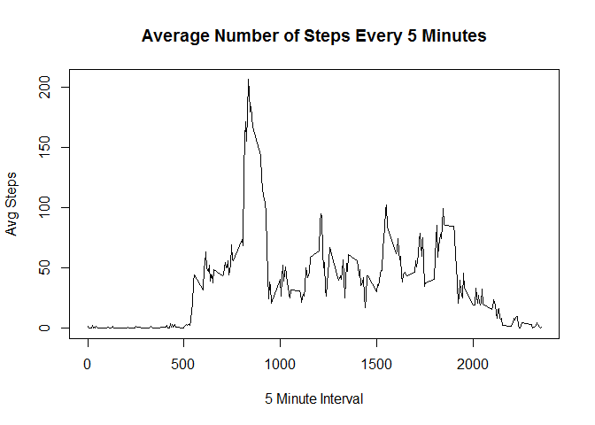
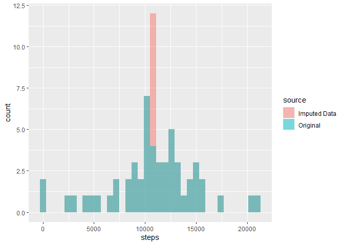
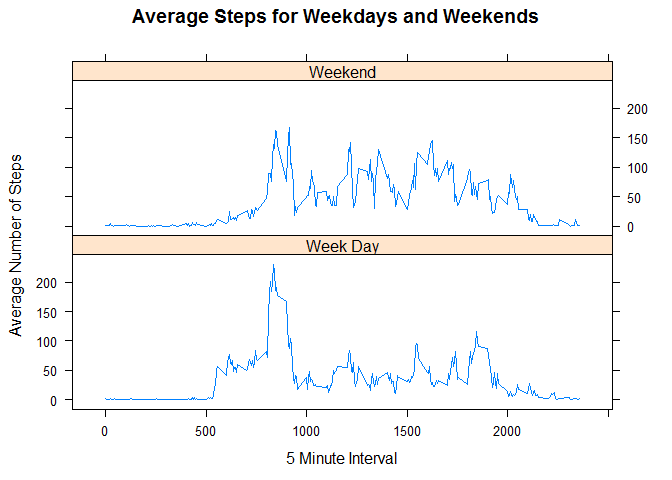

## Loading activity data.

Read csv file into R and format Date as date.


```r
movement <- read.csv("activity.csv")
movement$date <- as.Date(movement$date)
```

## Calculate total number of steps taken each day


```r
DaySteps <- aggregate(movement$steps ~ movement$date, FUN = sum)
DaySteps$steps <- as.numeric(DaySteps$`movement$steps`)
```

## Histogram of the total number of steps taken each day.


```r
hist(DaySteps$steps, breaks=7, xlab="Number of Steps", main="Total Steps per Day", col="blue")
```

<!-- -->

## Getting the mean number of steps taken each day.

```r
MeanSteps <- aggregate(movement$steps ~ movement$date, FUN = mean)
AvgSteps <- mean(MeanSteps$`movement$steps`, na.rm=TRUE)
```

Average number of steps taken each day **37.3825996**.

## Getting the median of the total steps taken each day.

```r
MedianSteps <- median(DaySteps$steps, na.rm = TRUE)
```

Median of steps per day **10765**.

## Make a time series plot of the average number of steps per 5 minute interval.


```r
interval_steps <- aggregate(movement$steps ~ movement$interval, FUN = mean)
#interval_steps <- tapply(movement$steps, movement$interval, mean, na.rm = TRUE)
colnames(interval_steps) <- c("interval", "steps")

plot(interval_steps$interval, interval_steps$steps, 
     type="l", 
     main="Average Number of Steps Every 5 Minutes",
     xlab="5 Minute Interval", 
     ylab="Avg Steps")
```

<!-- -->

## Find the 5 minute interval with the maximum number of steps

```r
MaxSteps <- interval_steps[interval_steps$steps == max(interval_steps$steps), ]
```

The maximum number of steps is **206.1698113** at interval **835**.

## Imput the missing values in the activity dataset.

### Number of missing values from the input dataset.


```r
MissingSteps <- nrow(movement[is.na(movement$steps), ])
```

The number of missing observations is **2304**.

## Strategy for imputing missing steps in the activity data.

### Activity data is separated into two data frames, one for intervals having steps another for missing entries.

```r
has_steps <- movement[!is.na(movement$steps), ]
na_steps <- movement[is.na(movement$steps), ]
```

### From the previously created data frame for average steps by interval, merge average values to the data frame for missing steps.

```r
StepsFiller <- merge(na_steps, interval_steps, by = "interval")
```

### Drop missing steps from the data frame.

```r
StepsFiller <- StepsFiller[c("steps.y", "date", "interval")]
```

### Combine the data frames back together now that missing values have been loaded with average steps.

```r
colnames(StepsFiller) <- c("steps", "date", "interval")
imputed_steps <- rbind(has_steps, StepsFiller)
colnames(imputed_steps) <- c("imputed_steps", "date", "interval")
```

### Merge original data with the data step containing imputed steps for additional analysis.

```r
movement_imput <- merge(movement, imputed_steps, by = c("date", "interval"))
```

### The imputed steps are totaled and aggregated by date. Data set with imputed data is created.

```r
DayStepsImput <- aggregate(movement_imput$imputed_steps ~ movement_imput$date, FUN = sum)
DayStepsImput$source <- "Imputed Data"
colnames(DayStepsImput) <- c("date", "steps", "source")

colnames(DaySteps) <- c("date", "steps", "drop")
DaySteps <- DaySteps[ ,c(1:2)]
DaySteps$source <- "Original"

i_mean <- mean(DayStepsImput$steps)
i_median <- median(DayStepsImput$steps)
```

### Plot showing the increase in the frequency of the observed steps.

```r
library(ggplot2)
DayStepsGraph <- rbind(DaySteps, DayStepsImput)
ggplot(DayStepsGraph, aes(steps, fill = source)) + geom_histogram(alpha = 0.5, position = "identity", binwidth = 600)
```

<!-- -->

### Findings of the data

The new mean for the imputed data is **10766.1886792** and the new median is **10766.1886792**. 

The mean remains identical to that of the loaded data. The median has been made identical to the mean with the imputed data added. The frequency of steps in the ~10,000 range has now heavily increased around the mean value added for the imputed dates. 

## Analysis of steps by weekdays and weekends.

```r
library(dplyr)
```

```
## 
## Attaching package: 'dplyr'
```

```
## The following objects are masked from 'package:stats':
## 
##     filter, lag
```

```
## The following objects are masked from 'package:base':
## 
##     intersect, setdiff, setequal, union
```

```r
library(lattice)
```

### Use weekday function to get days as a factor.

```r
movement_imput$weekday <- weekdays(movement_imput$date)
```

### Separate week days and weekend days and designate accordingly.

```r
steps_weekdays <- movement_imput[movement_imput$weekday == "Monday" | movement_imput$weekday == "Tuesday" |
                                        movement_imput$weekday == "Wednesday" | movement_imput$weekday == "Thursday"                                         | movement_imput$weekday == "Friday", ]
steps_weekdays$day <- "Week Day"
steps_weekends <- movement_imput[movement_imput$weekday == "Saturday" | movement_imput$weekday == "Sunday", ]
steps_weekends$day <- "Weekend"

movement_day <- rbind(steps_weekdays, steps_weekends)
```

### Summarize data over intervals and days to get the average.

```r
movement_day <- movement_day %>%
        group_by(interval, day) %>%
        summarize(steps = mean(imputed_steps))
```

### Create the lattice plot comparing the average steps for week days and weekends.

```r
xyplot(steps~interval|day, data=movement_day, type="l",  layout = c(1,2),
       main="Average Steps for Weekdays and Weekends", 
       ylab="Average Number of Steps", xlab="5 Minute Interval")
```

<!-- -->

Analysis of the plot indicates a higher average number of steps taken throughout the day on weekends.
